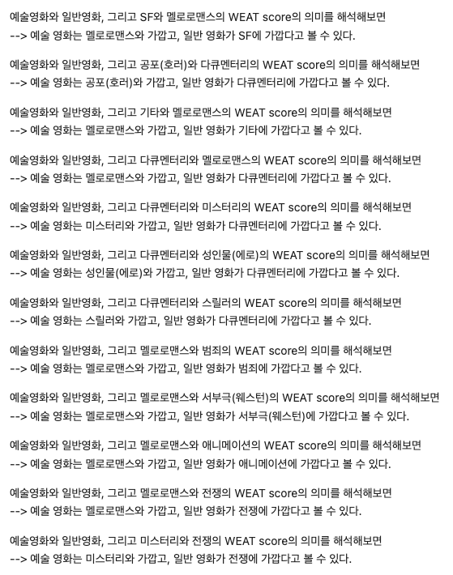
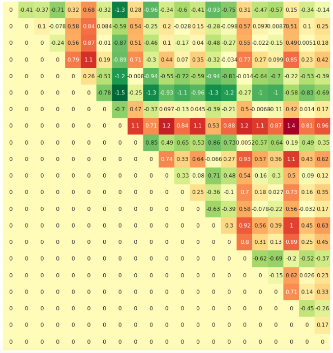

🔑 **PRT(Peer Review Template)**

- [x]  **1. 주어진 문제를 해결하는 완성된 코드가 제출되었나요? (완성도)**
    - 문제에서 요구하는 최종 결과물이 첨부되었는지 확인
    - 문제를 해결하는 완성된 코드란 프로젝트 루브릭 3개 중 2개, 
    퀘스트 문제 요구조건 등을 지칭
        - 해당 조건을 만족하는 부분의 코드 및 결과물을 캡쳐하여 사진으로 첨부



- [x]  **2. 프로젝트에서 핵심적인 부분에 대한 설명이 주석(닥스트링) 및 마크다운 형태로 잘 기록되어있나요? (설명)**
    - [x]  모델 선정 이유
    - [x]  Metrics 선정 이유
    - [x]  Loss 선정 이유

- [x]  **3. 체크리스트에 해당하는 항목들을 모두 수행하였나요? (문제 해결)**
    - [x]  데이터를 분할하여 프로젝트를 진행했나요? (train, validation, test 데이터로 구분)
    - [x]  하이퍼파라미터를 변경해가며 여러 시도를 했나요? (learning rate, dropout rate, unit, batch size, epoch 등)
    - [x]  각 실험을 시각화하여 비교하였나요?
    - [x]  모든 실험 결과가 기록되었나요?



- [x]  **4. 프로젝트에 대한 회고가 상세히 기록 되어 있나요? (회고, 정리)**
    - [x]  배운 점
    - [x]  아쉬운 점
    - [x]  느낀 점
    - [x]  어려웠던 점

```
    회고 - 배운 점 : 데이터의 편향성에 대해 인사이트가 생겼다
    - 아쉬운 점: 공부를 더해봐야 하는데 못햇다.
    - 느낀 점 : 재미있고 흥미 진진한 분야 인것 같다
    - 어려웠던 점 : 시간이 촉박함.

```

## 리뷰
- weat score가 크게 나온 값들이 많아서 저와 비교하면서 보니까 색다르게 느껴졌습니다
- 겹치는 단어를 제거해보는 전처리가 추가되면 좋을 것 같습니다.